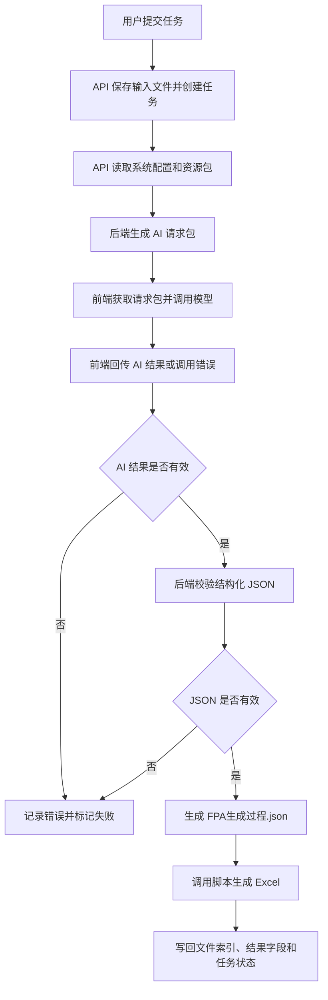
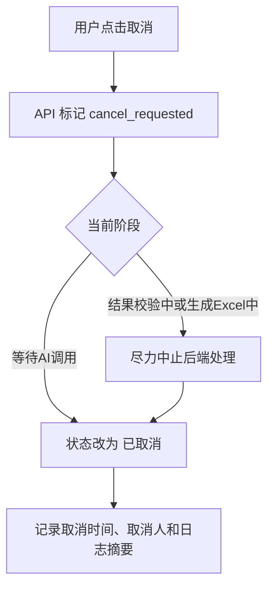

# FPA 任务流程设计

## 1. 总体流程



首版流程只覆盖单个需求的一次评估，不包含批量评估、草稿保存、在线编辑、人工审批、多人协同复核和结果对比。

首版验收以流程跑通和产物可用为准，不要求人工抽查评估准确性。

后台执行机制引用平台级任务处理设计，详见 [03-任务处理与结果生成设计.md](../../architecture/03-任务处理与结果生成设计.md)。本文档只描述 FPA 模块的阶段流转和产物规则。

## 2. 提交流程

用户提交 FPA 任务后，API 负责完成以下动作：

1. 校验登录状态。
2. 校验系统选择、需求名称、文本内容、上传文件和目标人天。
3. 生成唯一 `task_id`。
4. 创建任务记录。
5. 保存粘贴文本和上传 `.md` 文件。
6. 生成统一输入文件 `merged_input.md`。
7. 读取 FPA 资源包、系统资料配置和页面参数。
8. 生成 AI 请求包。
9. 任务状态改为 `等待AI调用`。
10. 返回任务详情地址，前端跳转查看状态。

提交校验规则：

- 系统选择必须存在，且只能选择一个系统。
- 需求名称可以为空。
- 粘贴文本和上传 `.md` 至少提供一项。
- 粘贴文本有效内容不超过 2 万字符。
- 上传 `.md` 文件有效内容不超过 2 万字符。
- 上传 `.md` 文件大小不超过 256KB。
- 目标人天为空或大于 0。
- 目标人天最多保留 1 位小数。

输入内容保存为文件后再用于生成 AI 请求包，不在任务表中保存大段正文。

## 3. 任务目录

每个任务使用独立目录：

```text
data/tasks/fpa/{task_id}/
  input/
  ai/
  output/
  runtime/
```

目录用途：

- `input/`：保存用户原始输入和合并后的统一输入。
- `ai/`：保存 AI 请求包、模型原始响应、结构化 JSON 和 AI 调用错误。
- `output/`：保存用户可下载的正式 Excel。
- `runtime/`：保存日志、临时文件和排查文件。

创建任务目录时如果发现目录已存在：

- 不删除。
- 不覆盖。
- 不清空。
- 当前任务标记为失败。
- 失败原因记录为“任务目录已存在，疑似重复任务 ID 或历史残留”。
- 保留现场供管理员排查。

## 4. 输入文件生成

API 保存输入文件时，按以下规则处理：

1. 如果存在粘贴内容，保存为 `input/pasted.md`。
2. 如果存在上传文件，保存为 `input/uploaded.md`。
3. 如果两者都存在，按“粘贴内容在前、上传内容在后”生成 `input/merged_input.md`。
4. 如果只有一种输入，也生成 `input/merged_input.md`，便于后端统一生成 AI 请求包。
5. 后端使用 `merged_input.md` 生成 AI 请求包。

## 5. AI 请求包生成方式

推荐方式是把用户输入保存为任务目录中的文件，再由后端读取受控文件和资源生成 AI 请求包。

这样做的原因：

- 文件方式更容易复现，同一个任务可以用同一份输入重跑。
- 文件方式更利于排查，可以明确看到原始输入、分析结果和脚本输出。
- 文件方式边界更清楚，平台只读取受控路径。
- 后端统一组装请求包，前端不硬编码提示词、系统资料和 FPA 规则。

AI 请求包应包括：

- 用户输入正文。
- 已选择系统的必要资料摘要或无资料模式说明。
- 是否无资料模式。
- 目标人天，作为 AI 可参考的校准目标。
- 页面选择和平台默认合并后的项目特征。
- 输出文件要求。
- FPA 评估规约和 JSON 输出要求。

AI 请求包不得包含服务器绝对路径、密钥、Cookie 或用户无权查看的内部配置。

## 6. 系统资料读取

后端根据任务中的系统编码读取系统配置。

处理规则：

- 如果系统配置存在且资料目录存在，按资源包规则生成资料摘要或引用说明。
- 如果系统为明确的无资料系统，生成无资料模式标记。
- 如果已配置系统的资料目录或精简知识包不存在，任务失败并记录系统资料配置错误。
- 不允许已配置系统静默降级为无资料模式。

平台不默认把资料全文拼接进请求包，避免 token 过大。具体资料摘要、路由和引用策略由 FPA 资源包配置控制。

## 7. FPA 执行阶段

FPA 首版按阶段推进任务状态：

| 阶段 | 状态 | 主要动作 |
|---|---|---|
| 创建任务 | 等待AI调用 | 保存输入、读取资源包、生成 AI 请求包 |
| 前端调用模型 | 等待AI调用 | 前端获取请求包并调用外部模型 |
| 接收结果 | 结果校验中 | 后端接收 AI 原始响应、结构化 JSON 或调用错误 |
| 校验结果 | 结果校验中 | 校验 JSON schema、枚举值和必要字段 |
| 生成文件 | 生成Excel中 | 调用脚本生成 Excel |
| 完成 | 已完成 | 写回结果路径和汇总信息 |

任一阶段失败时，状态改为 `失败`，并记录失败阶段。

## 8. AI 请求与 JSON 产物

首版 AI 产物应尽量结构化。前端需要把模型原始响应和结构化结果回传后端。

`AI分析.md` 是可选的模型生成说明，应包含：

- 给用户看的 FPA 分析说明。
- 模型对不确定项的解释。

`AI结构化结果.json` 是脚本生成 Excel 的核心输入来源。

约定：

- JSON 字段以现有 Excel 模板需要填充的字段为准。
- JSON 同时保留 Excel 填充值和 AI 解释文本。
- Excel 生成脚本只使用结构化填充值。
- AI 解释文本只用于页面查看和人工理解。
- JSON 块必须是合法 JSON。
- JSON 字段结构由后续 FPA 详细设计固定。
- 脚本解析成功后生成 `FPA生成过程.json`。

如果前端拿到的模型结果无法解析为后端要求的 JSON，可以由前端按页面规则提示用户重试一次；后端只接收最终回传结果或失败信息。后端校验失败时不自动调用模型修复。

## 9. Excel 生成

Excel 由内置脚本按现有模板生成，不由大模型直接生成。

处理规则：

- 脚本输入为 `FPA生成过程.json`。
- 脚本输出为一个 `.xlsx` 文件。
- 全平台使用一套 Excel 模板。
- 保留模板工作表、格式、公式和参数区。
- 只写模板约定的输入区域和功能点明细行。
- 不主动覆盖公式单元格。
- 条目超过模板默认行数时，脚本动态增加行。
- 动态插行不能破坏模板公式和格式。
- 不拆分多个 Excel。
- 保存时设置工作簿打开后重算公式。

首版可复用现有 FPA 脚本，但需要增强动态插行能力，避免固定 `29` 条上限。

## 10. 文件落地规则

FPA 关键产物先写临时文件，成功后再改名为正式文件。

```text
AI分析.md.tmp -> AI分析.md
AI结构化结果.json.tmp -> AI结构化结果.json
FPA生成过程.json.tmp -> FPA生成过程.json
结果.xlsx.tmp -> 结果.xlsx
```

规则：

- `.tmp` 文件不登记为正式产物。
- 正式文件生成后才写入 `task_files`。
- 如果任务失败，保留 `.tmp` 文件供管理员排查。
- 普通用户不能查看 `.tmp` 文件。

## 11. 页面结果计算

页面展示的 `结果中值` 和 `是否命中目标` 不能依赖读取 Excel 公式缓存值。

处理规则：

- 不引入 LibreOffice 或 Office 作为服务端计算依赖。
- 后台脚本按 Excel 模板公式口径同步计算关键结果。
- 计算结果写入数据库。
- Excel 模板中的公式仍保留，供用户打开文件后自动重算和人工调整。
- 目标人天可以进入 AI 请求包作为参考目标，但最终人天和目标命中判断只以脚本计算结果为准。

当 Excel 模板公式口径变化时：

1. 更新 [04-FPA计算规则.md](04-FPA计算规则.md)。
2. 更新后台脚本中的集中计算逻辑。
3. 检查模板公式与脚本结果是否一致。
4. 再进入功能实现或发布。

## 12. 取消流程

取消流程如下：



取消规则：

- 取消是尽力而为操作。
- 如果任务已经进入已完成、失败或已取消状态，则不能再取消。
- 取消任务不生成正式结果文件。
- 取消任务保留任务记录和取消日志摘要。

## 13. 失败处理

失败任务不清理排查所需文件。

需要记录：

- 失败阶段。
- 错误摘要。
- 脱敏错误详情。
- 管理员完整错误详情。
- 任务日志路径。
- 重试次数。
- 工作目录路径。

普通用户错误信息需要详细但脱敏，管理员错误信息用于排查。

失败任务不自动重跑。用户或管理员可以重新运行，重新运行时新建任务并关联原任务，原失败任务不覆盖。

## 14. 成功处理

成功任务需要写回：

- 完成时间。
- 耗时。
- 是否无资料模式。
- 重试次数。
- 目标人天。
- 结果中值。
- 是否命中目标。
- 轻量质量提示。
- Excel 文件路径。
- `AI分析.md` 路径。
- `FPA生成过程.json` 路径。

成功任务需要写入正式文件索引：

- `AI分析.md`
- `AI结构化结果.json`
- `FPA生成过程.json`
- Excel 结果文件
- `task.log`

用户可下载 Excel，并在页面查看、复制 `AI分析.md` 和 JSON。

任务详情页展示轻量质量提示，不做评分。提示项包括无资料模式、目标人天异常、功能点条目过多、AI 调用失败重试和当前资源文件是否可读取。

质量提示只提示风险，不阻止用户下载和使用 Excel。

## 15. 重新运行

重新运行规则：

- 不复用原任务目录。
- 不覆盖原任务。
- 新建任务 ID。
- 复制原任务输入内容。
- 生成新的任务目录。
- 原任务保留。
- 通过 `rerun_from_task_id` 关联原任务。

## 16. 验收样例

首版需要保留开发与验收样例，但不在前端页面展示。

样例来源以现有 FPA 工具目录为准：

```text
D:\project\fpa功能点法工作量评估
```

验收样例至少用于验证：

- 任务提交、AI 请求包生成、AI 结果回传和状态流转。
- AI 请求包、AI 结果回传、`FPA生成过程.json` 和 Excel 产物生成。
- Excel 模板格式、公式和参数区保留。
- 历史任务查看和 Excel 下载。
- 失败任务重新运行。
